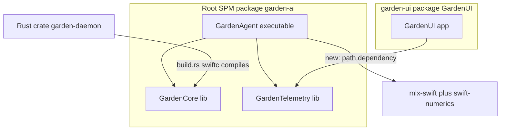

# Garden AI: Modular Migration, Consumer Wiring, and MLX Runtime Fix

## Impact report: current state

Three locations hold the same Swift logic; the root package is the canonical source of truth.

- Root SPM package `garden-ai` ([Package.swift](Package.swift)) defines `GardenCore`, `GardenTelemetry`, `GardenAgent`.
- Duplicate set A (daemon): [crates/garden-daemon/src/swift/Virtualizer.swift](crates/garden-daemon/src/swift/Virtualizer.swift), [bridging_impl.swift](crates/garden-daemon/src/swift/bridging_impl.swift), [bridging.h](crates/garden-daemon/src/swift/bridging.h) — compiled by [build.rs](crates/garden-daemon/build.rs) via `swiftc` into `libgarden_swift.a`. Functionally identical to `Sources/GardenCore` (diff = comments/escaping only).
- Duplicate set B (UI): [garden-ui/Sources/GardenUI/SecurityEvent.swift](garden-ui/Sources/GardenUI/SecurityEvent.swift), [EventWireTypes.swift](garden-ui/Sources/GardenUI/EventWireTypes.swift), [TelemetryStream.swift](garden-ui/Sources/GardenUI/TelemetryStream.swift) — `internal` copies; the `Sources/GardenTelemetry` versions are already `public`.




Key facts that shape the plan:

- Rust FFI in [virtualizer.rs](crates/garden-daemon/src/virtualizer.rs) declares its own `extern "C"` block; `bridging.h` is NOT consumed by the build or by bindgen. It is only named in three `cargo:rerun-if-changed` lines. The `@_cdecl` symbol names match exactly, so redirecting source paths is transparent to Rust.
- `garden-ui` references telemetry types in 5 files and never uses `GardenCore`/Virtualization FFI: [DaemonClient.swift](garden-ui/Sources/GardenUI/DaemonClient.swift), [EventRowView.swift](garden-ui/Sources/GardenUI/EventRowView.swift), [MockData.swift](garden-ui/Sources/GardenUI/MockData.swift), [SessionsView.swift](garden-ui/Sources/GardenUI/SessionsView.swift), [AppState.swift](garden-ui/Sources/GardenUI/AppState.swift).
- Nothing under `.build/` or `.swiftpm/` is currently tracked, so Task 3 is purely preventative (no `git rm --cached` needed). `Package.resolved` is tracked and should stay tracked.
- MLX root cause: plain `swift build`/`swift run` has no Metal shader compiler, so `mlx-swift_Cmlx.bundle/.../default.metallib` is never produced and MLX throws "Failed to load the default metallib." Fix = build via `xcodebuild` and run in place.

## Task 1: Delete duplicates and redirect references

### Daemon (set A)

- `git rm` all three files in `crates/garden-daemon/src/swift/`.
- Edit [crates/garden-daemon/build.rs](crates/garden-daemon/build.rs): repoint the two `swiftc` source args and the rerun triggers at the canonical sources, and drop the `bridging.h` trigger (a rerun-if-changed on a deleted file forces the script to re-run every build):

```rust
println!("cargo:rerun-if-changed=../../Sources/GardenCore/Virtualizer.swift");
println!("cargo:rerun-if-changed=../../Sources/GardenCore/bridging_impl.swift");
// ...
        .args([
            "-emit-library",
            "-static",
            "-emit-objc-header",
            "-emit-objc-header-path", &swift_header_path,
            "-o", &static_lib_path,
            "-framework", "Virtualization",
            "-framework", "Foundation",
            "../../Sources/GardenCore/Virtualizer.swift",
            "../../Sources/GardenCore/bridging_impl.swift",
        ])
```

- Paths are relative to the crate root (`crates/garden-daemon/`), so `../../Sources/GardenCore/...` resolves to the repo root. We deliberately do NOT add `VMManager.swift` (daemon does not need it; keeps the static archive minimal and behavior identical).

### UI (set B)

- `git rm` `SecurityEvent.swift`, `EventWireTypes.swift`, `TelemetryStream.swift` from `garden-ui/Sources/GardenUI/`.
- Add `import GardenTelemetry` to the 5 referencing files above. `EventRowView`/`SecurityFeedView` consume the types' `Identifiable`/member API, so the build will dictate the exact final set — add the import wherever `swift build` reports an unresolved `SecurityEvent`/`WireEvent`/`TelemetryStream`.
- History note: git preserves deleted-file history; the canonical copies already exist in `Sources/` from commit `e7b8c01`, so this is a clean dedup, not a lossy move.

## Task 2: Wire consumer dependencies

### garden-ui -> GardenTelemetry only (exact manifest change)

Rewrite [garden-ui/Package.swift](garden-ui/Package.swift) to add the path dependency and link only `GardenTelemetry` (bump tools to 5.10 to match root):

```swift
// swift-tools-version: 5.10
import PackageDescription

let package = Package(
    name: "GardenUI",
    platforms: [.macOS(.v14)],
    dependencies: [
        .package(path: "..")
    ],
    targets: [
        .executableTarget(
            name: "GardenUI",
            dependencies: [
                .product(name: "GardenTelemetry", package: "garden-ai")
            ],
            path: "Sources/GardenUI"
        )
    ]
)
```

- The `package:` label is the root package identity `garden-ai` (matches `name:` in the root manifest and the `..` directory name). If SPM reports an identity mismatch, fall back to the resolved directory name.
- GardenCore is intentionally NOT linked into the UI (no Virtualization usage). Default static linkage is used (no `type: .dynamic`); "dynamic" linkage would add rpath/embedding complexity for no benefit in a single app.

### garden-daemon -> GardenCore

- Already accomplished by the Task 1 build.rs redirect: a Rust crate cannot `import` a Swift SPM module, so compiling GardenCore's canonical sources into the linked static archive is the correct analog. No `Package.swift` change applies to the daemon.

### Public-visibility validation

- GardenCore: `GardenVirtualizer` (+ `public override init()`, `checkHardwareSupport()`) and all `@_cdecl` funcs are already `public`; `GardenAgent`'s `import GardenCore` usage compiles. Daemon relies on C-ABI symbols, not Swift access control.
- GardenTelemetry: all types, members, and initializers used by the UI (`init(...)`, `.kind`, `.icon`, `.color`, `.description`, `.timeString`, `.isViolation`, `.violationMessage`, `TelemetryStream().onEvent/start/stop`, `WireEvent.toSecurityEvent()`) are already `public`. Expected outcome: no new `public` edits required; confirm with the UI build.

## Task 3: .gitignore hardening

Add root-level (depth-agnostic) SPM ignores to [.gitignore](.gitignore); these also cover `garden-ui/` and the Task 4 derived-data dir:

```gitignore
# === Swift Package Manager (root + nested packages) ===
.build/
.swiftpm/
DerivedData/
```

- Keep `Package.resolved` tracked. The pre-existing `garden-ui/.build/` etc. lines become redundant (harmless); optional to prune.

## Task 4: MLX metallib runtime fix (root Makefile + headless xcodebuild)

Create a root `Makefile` with scoped targets (correct scheme name `GardenAgent`; run in place so the co-located metallib is found):

```makefile
DERIVED := ./.build/xcode
AGENT_BIN := $(DERIVED)/Build/Products/Debug/GardenAgent

.PHONY: agent run-agent daemon schemes

schemes:
	xcodebuild -list

agent:
	xcodebuild build -scheme GardenAgent -configuration Debug \
	  -destination 'platform=macOS' -derivedDataPath $(DERIVED)

run-agent: agent
	$(AGENT_BIN)

daemon:
	cd crates/garden-daemon && ./run.sh
```

- Why: SwiftPM cannot compile `.metal`; `xcodebuild` compiles `default.metallib` into `mlx-swift_Cmlx.bundle` next to the product, resolving the runtime error. Confirmed against mlx-swift issues #36/#30 and community docs.
- Zero-copy GPU: MLX uses Apple Silicon unified memory automatically (lazy arrays in shared memory); no extra flag is needed once the metallib loads. The smoke test in [Sources/GardenAgent/main.swift](Sources/GardenAgent/main.swift) (`MLXArray([...]).sum()`) will then execute on GPU.
- Caveats to document: the binary must run in place (moving it re-breaks MLX); and when `GardenAgent` later boots a VM it will need ad-hoc codesigning with the virtualization entitlement (mirror `crates/garden-daemon/entitlements.plist`).
- Scope note: `main.swift` does not yet load `mlx-community/Qwen2.5-7B-Instruct-4bit`; that needs the `MLXLLM`/`Hub` products from `mlx-swift-examples` and a model download path. The metallib fix unblocks GPU execution; wiring the actual quantized model is a separate follow-up.

## Verification

- `cargo build -p garden-daemon` (recompiles Swift from the new path; FFI symbols unchanged).
- `cd garden-ui && swift build` (resolves root package, compiles against `GardenTelemetry`).
- `make run-agent` -> prints the MLX test sum with no metallib error.
- `git status` -> confirms 6 deletions staged and no `.build/`/`.swiftpm/` noise.

## Post-completion follow-ups (each becomes its own plan)

These are intentionally OUT OF SCOPE for the 7 tasks above. They are recorded here as the reference spec; once the main plan verifies green, the closeout step (`followup-doc`) persists them into the repo (`docs/tech-debt.md`) and a dedicated plan is created for FU-1 for review.

### FU-1 (PRIMARY): Decouple SwiftUI presentation from GardenTelemetry

- Problem: [Sources/GardenTelemetry/SecurityEvent.swift](Sources/GardenTelemetry/SecurityEvent.swift) does `import SwiftUI` solely to expose `SecurityEvent.Kind.color: Color` and `SecurityEvent.Kind.icon: String` (SF Symbol name). This leaks a UI/presentation concern into the data/telemetry layer, so any non-UI consumer (future CLI, headless telemetry sink, tests) is forced to drag SwiftUI.
- Target design: keep `GardenTelemetry` pure `Foundation`/`Network`. Move presentation accessors into a UI-side extension, e.g. a new `garden-ui/Sources/GardenUI/SecurityEvent+Presentation.swift` providing `var color: Color` and `var icon: String` on `SecurityEvent.Kind`.
- Files affected:
  - [Sources/GardenTelemetry/SecurityEvent.swift](Sources/GardenTelemetry/SecurityEvent.swift): drop `import SwiftUI`, remove `color`/`icon` (keep `description`; keep `timeString`, which is Foundation-only `DateFormatter`).
  - New `garden-ui/Sources/GardenUI/SecurityEvent+Presentation.swift` (the moved `color`/`icon`).
  - UI consumers that read `.color`/`.icon`: [EventRowView.swift](garden-ui/Sources/GardenUI/EventRowView.swift) and any of `SecurityFeedView.swift`/`StatusIslandView.swift` the build flags.
- Acceptance: `grep -R "import SwiftUI" Sources/GardenTelemetry` returns nothing; both packages build; UI still renders the same icons/colors.
- Sequencing: must run AFTER this plan (depends on the UI already importing `GardenTelemetry`, and on the duplicate `garden-ui` copies being deleted).

### FU-2: Extract an MLX-free `GardenKit` package

- Move `GardenCore`+`GardenTelemetry` into their own package so the UI dependency graph stops resolving `mlx-swift`/`swift-numerics` entirely (true build isolation; removes the transitive fetch noted in Task 2).

### FU-3: Resolve the orphaned root test target

- [Tests/garden-aiTests/garden_aiTests.swift](Tests/garden-aiTests/garden_aiTests.swift) imports a nonexistent `garden_ai` module and has no test target in the root manifest; either declare a `.testTarget` or delete the file.

### FU-4: Wire the real quantized model

- `GardenAgent` currently only runs an `MLXArray` smoke test; loading `mlx-community/Qwen2.5-7B-Instruct-4bit` needs the `MLXLLM`/`Hub` products from `mlx-swift-examples` plus a model download path.

