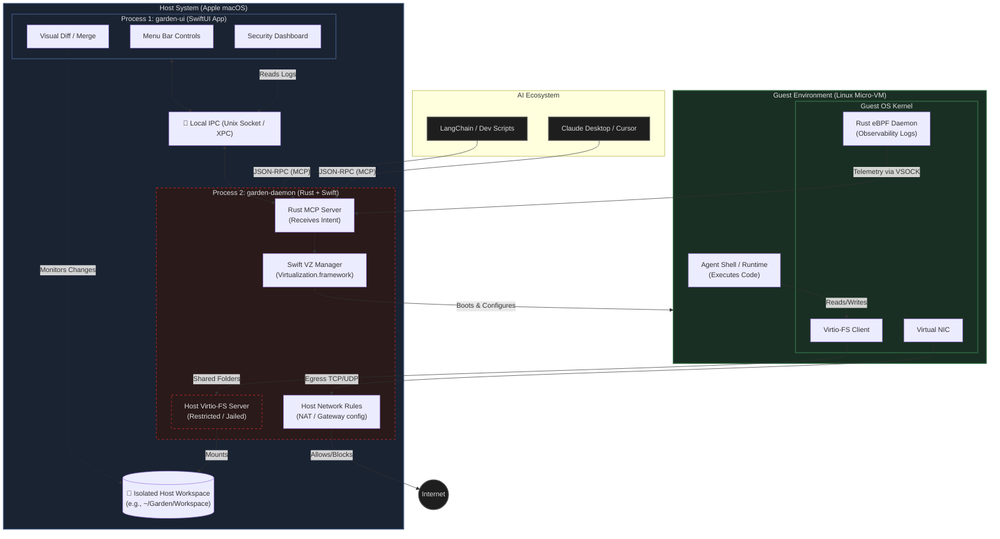

# Garden AI Architecture Diagram

```mermaid
flowchart TD
    %% Styling
    classDef external fill:#1e1e1e,stroke:#4a4a4a,stroke-width:2px,color:#dcdcdc
    classDef macos fill:#1a2332,stroke:#3b5278,stroke-width:2px,color:#e0e0e0
    classDef sandbox fill:#2a1a1a,stroke:#8b2525,stroke-width:2px,color:#e0e0e0,stroke-dasharray: 5 5
    classDef guest fill:#1a2f23,stroke:#306b44,stroke-width:2px,color:#e0e0e0

    %% External Clients
    subgraph External["AI Ecosystem"]
        Claude["Claude Desktop / Cursor"]
        LangChain["LangChain / Dev Scripts"]
    end

    %% macOS Host Environment
    subgraph HostOS["Host System (Apple macOS)"]
        
        %% UI Process
        subgraph UIApp["Process 1: garden-ui (SwiftUI App)"]
            MenuBar["Menu Bar Controls"]
            DiffView["Visual Diff / Merge"]
            SecDash["Security Dashboard"]
        end
        
        %% IPC Boundary
        IPC["🔌 Local IPC (Unix Socket / XPC)"]
        
        %% Daemon Process in Sandbox
        subgraph Daemon["Process 2: garden-daemon (Rust + Swift)"]
            direction TB
            MCPServer["Rust MCP Server\n(Receives Intent)"]
            VMManager["Swift VZ Manager\n(Virtualization.framework)"]
            HostFirewall["Host Network Rules\n(NAT / Gateway config)"]
            VirtioFS["Host Virtio-FS Server\n(Restricted / Jailed)"]
        end
        
        %% Host Filesystem
        Workspace[("📁 Isolated Host Workspace\n(e.g., ~/Garden/Workspace)")]
    end

    %% The Micro-VM Sandbox
    subgraph MicroVM["Guest Environment (Linux Micro-VM)"]
        direction TB
        subgraph Kernel["Guest OS Kernel"]
            GuestFS["Virtio-FS Client"]
            vNIC["Virtual NIC"]
            eBPF["Rust eBPF Daemon\n(Observability Logs)"]
        end
        
        Shell["Agent Shell / Runtime\n(Executes Code)"]
    end

    %% Connections
    Claude & LangChain -- "JSON-RPC (MCP)" --> MCPServer
    
    UIApp <--> IPC
    IPC <--> MCPServer
    
    MCPServer --> VMManager
    VMManager -- "Boots & Configures" --> MicroVM
    
    %% FS Connections
    VirtioFS -- "Mounts" --> Workspace
    GuestFS -- "Shared Folders" --> VirtioFS
    Shell -- "Reads/Writes" --> GuestFS
    DiffView -. "Monitors Changes" .-> Workspace
    
    %% Network Boundary
    vNIC -- "Egress TCP/UDP" --> HostFirewall
    HostFirewall -- "Allows/Blocks" --> Internet((Internet))
    
    %% Telemetry
    eBPF -- "Telemetry via VSOCK" --> MCPServer
    SecDash -. "Reads Logs" .-> IPC

    %% Apply Classes
    class Claude,LangChain,Internet external
    class HostOS,UIApp,Daemon macos
    class Daemon,VirtioFS sandbox
    class MicroVM,Kernel guest
```
