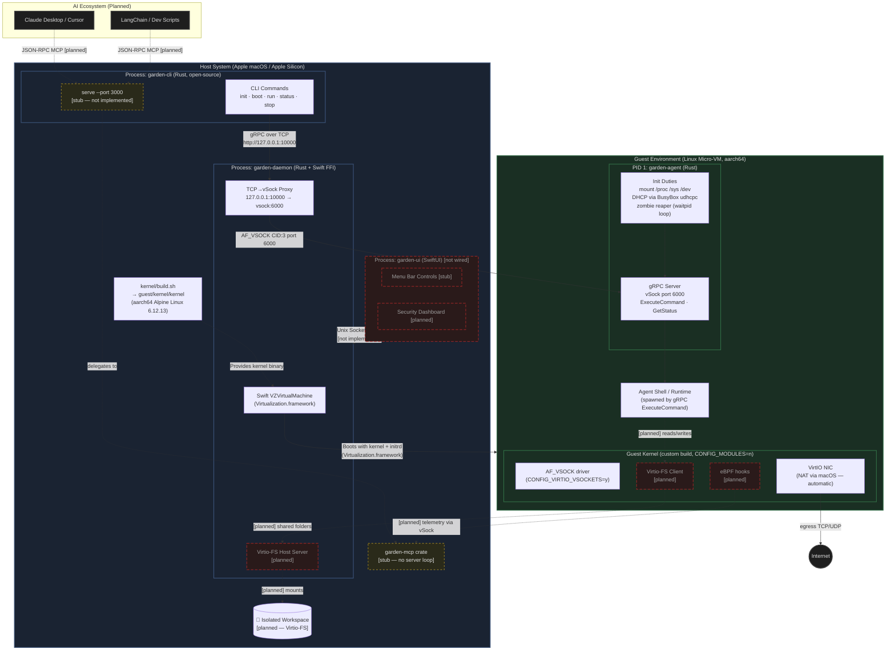

# Garden AI Architecture — As-Built (v2)

> **Legend:**
> - **Solid lines** = implemented and working
> - **Dashed lines** = planned / not yet implemented
> - **Yellow nodes** = stub (compiles but no logic)
> - **Red/dark nodes** = planned (not yet started)
>
> Compare with [`architecture_diagram.md`](./architecture_diagram.md) for the original planning-phase design.

---

## What Changed from the Original Plan

| Area | Original `architecture_diagram.md` | This Diagram (as-built) |
|---|---|---|
| **MCP Server** | Inside `garden-daemon`, the entry point | Separate `garden-mcp` stub crate; `garden-cli serve` would host it |
| **CLI tool** | Not shown | `garden-cli` is the primary user interface |
| **Guest agent** | Vague "Agent Shell / Runtime" | `garden-agent` is a Rust **PID 1 gRPC server** with full init duties |
| **Host↔Guest protocol** | Not specified | **gRPC-over-vSock** on port 6000, with TCP→vSock proxy in daemon |
| **Virtio-FS** | Core filesystem sharing mechanism | Not implemented — `guest/rootfs/` is an empty placeholder |
| **eBPF daemon** | Running, sending telemetry via vSock | Stub only — no probes loaded, no events emitted |
| **UI↔Daemon IPC** | Unix Socket / XPC shown as working | `garden-ui` exists but is not wired to the daemon |
| **Host Firewall** | Explicit NAT/gateway component | Apple's built-in NAT handles it — no custom rules needed |
| **Kernel build** | Not shown | `kernel/build.sh` produces custom aarch64 kernel (Alpine 6.12.13) |

## Current Status

**Working end-to-end:**
- VM boot via Apple Virtualization.framework (Swift + Rust FFI)
- Custom aarch64 Linux kernel with vSock support
- `garden-agent` as PID 1: mounts pseudo-fs, DHCP, gRPC server
- gRPC `ExecuteCommand` over AF_VSOCK (CID 3, port 6000)
- TCP→vSock proxy for CLI connectivity
- `garden-cli`: `init`, `boot`, `run` commands

**Stubs (compiles, no logic):**
- `garden-mcp` — MCP server crate skeleton
- `garden-ui` — SwiftUI app (not wired to daemon)

**Planned (not started):**
- Virtio-FS filesystem sharing
- eBPF security probing and telemetry
- UI↔Daemon IPC bridge
- Sandbox lifecycle management (`status`, `stop`, `list`)
- MCP tool/resource implementation for AI client connectivity
